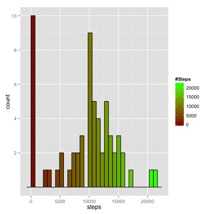
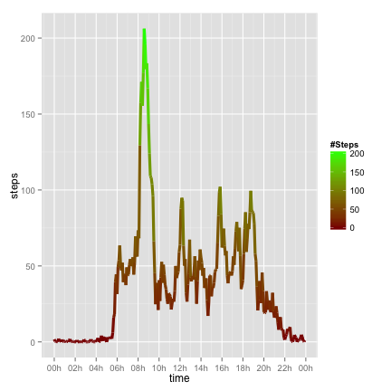
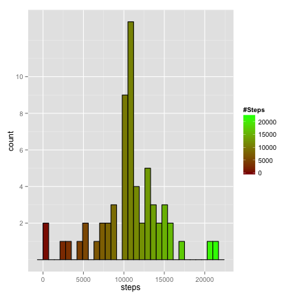
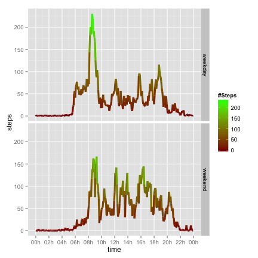

Reproducible Research - Assessment 1
====================================


## *Abstract*

*The following document describes a brief analysis performed on data collected
from a personal activity monitoring device, as an introduction to* **Literate
Programming**.  


  
  
## 1. Load Data

### Source
Data was obtained from the following [link][1] on Sun Jun 15 2014.  

Raw data is a .csv file containing the number of steps registered through five
minute intervals for a user during the months of October and November 2012.  

It is structured so as follows:
- *steps*: number of step recorded for the given 5 minute interval
- *date*: date of the day
- *interval*: 5 minute interval of the record

[1]: https://d396qusza40orc.cloudfront.net/repdata%2Fdata%2Factivity.zip "link"

### Loading and Processing

Data was loaded into an R data.frame object.

```r
data <- read.csv("activity.csv")
```

Since *interval* variable contains data as integer, an additional variable 
(*time*) was created with the formated (24hr) start-time of the interval.

```r
data$time <- sprintf("%04d",data$interval)
data$time <- with(data, paste(substr(time, 1, 2),substr(time, 3, 4), sep=":"))
```

Find below the structure of the data:

```r
head(data)
```

```
##   steps       date interval  time
## 1    NA 2012-10-01        0 00:00
## 2    NA 2012-10-01        5 00:05
## 3    NA 2012-10-01       10 00:10
## 4    NA 2012-10-01       15 00:15
## 5    NA 2012-10-01       20 00:20
## 6    NA 2012-10-01       25 00:25
```
  
  
## 2. Steps per Day

For a first analysis of the number of steps the user recorded, the daily
step-count is calculated.

```r
steps <- with(data, tapply(steps, date, sum, na.rm=TRUE))
data.daily <- data.frame(day=unique(data$date), steps=steps)
```

The following histogram shows the daily step-counts recorded throughout the two months of monitored data.

```r
ggplot(data.daily, aes(x=steps)) + 
    geom_histogram(aes(fill = ..x..), colour = "black", binwidth = 700) +
    scale_fill_gradient("#Steps", low = "darkred", high = "green") +
    scale_y_continuous(breaks=c(2,4,6,8,10))
```

 


The daily-step count average is 9354.2295, and the median 10395.
  

## 3. Daily Activity

The second analysis is an average-day daily-activity time-series, in which
the mean steps for each interval is obtained (averaged over all observed days).

```r
steps <- with(data, tapply(steps, time, mean, na.rm=TRUE))
data.activity <- data.frame(time=strptime(unique(data$time),"%H:%M"),
                            steps=steps)
```

The obtained data is plotted in a time-series format as follows.

```r
ggplot(data.activity, aes(time,steps, group=1)) +
    geom_line(aes(colour= ..y..), size = 1.5) +
    scale_colour_gradient("#Steps", low = "darkred", high = "green") +
    scale_x_datetime(breaks = date_breaks("2 hours"),
                     labels = date_format("%Hh"))
```

 


The average-daily 5-minute interval with most activity count starts at 08:35.
  

## 4. Missing Values


The data has 2304 missing observations (NA). For those values several
fill-in strategies may be applied:
- input the day average or median
- input the average or median for the specific interval
- input an interpolation between the previous and the following intervals  

The ensuing code fills-in the missing values according to the first possible
strategy (daily-average for that interval).

```r
# Interval daily-averages
int.avg <- data.frame(avg= data.activity$steps,interval=unique(data$interval))
# Merge with original data in auxiliary file
data.fill <- merge(data,int.avg, by='interval')
data.fill$steps[is.na(data.fill$steps)] <- data.fill$avg[is.na(data.fill$steps)]
```


The new data has 0 missing observations.

### Recalculate Steps per Day

The steps per day analysis is performed over the new, complete data set. 

```r
steps.f <- with(data.fill, tapply(steps, date, sum))
data.f.daily <- data.frame(day=unique(data.fill$date), steps=steps.f)
# Plot histogram
ggplot(data.f.daily, aes(x=steps)) + 
    geom_histogram(aes(fill = ..x..), colour = "black", binwidth = 700) +
    scale_fill_gradient("#Steps", low = "darkred", high = "green") +
    scale_y_continuous(breaks=c(2,4,6,8,10))
```

 


The new daily-step count average is 10766, and the median 10766.  

By means of this transformation, outlier (missing) values have been substituted
with an inference (a probable guess) of what most likely was the true value.  
  
As shown in the histogram, and further evidenced in the new median and mean, the
new data is more centered. The fill-in of missing data has eliminated the
numerous zeros found in the first histogram, and an average value has been
used in there placed. Additionally, the median (being more robust than the
mean) was closer to the inferred value mean and median.  


## 5. Weekdays vs. Weekends

The last analysis comprises a comparison between the activity on weekdays and
the activities on weekends.  

In order to perform the analysis a factor variable is created in order to
analyse the differences between the two different daily activity time-series
plots.


```r
weekend <- c("Saturday", "Sunday")
data.fill$weekend <- weekdays(strptime(data.fill$date,"%Y-%m-%d")) %in% weekend
```

### Daily activity: Weekday/Weekend

The same analysis carried out previously, now performed separately, now shows
the following average-day activity levels.

```r
# Weekday time-series
steps.wd <- with(subset(data.fill,weekend == FALSE),
                 tapply(steps, interval, mean, na.rm=TRUE))
data.activity.wd <- data.frame(time=strptime(unique(data$time),"%H:%M"),
                               steps=steps.wd, weekday = "weekday")

# Weekend time-series
steps.we <- with(subset(data.fill,weekend == TRUE),
                 tapply(steps, interval, mean, na.rm=TRUE))
data.activity.we <- data.frame(time=strptime(unique(data$time),"%H:%M"),
                               steps=steps.we, weekday = "weekend")

# Append both data frames
data.activity.f <- rbind(data.activity.wd,data.activity.we)

# Plot time-series
ggplot(data.activity.f, aes(time,steps, group=1)) +
    geom_line(aes(colour= ..y..), size = 1.5) +
    scale_colour_gradient("#Steps", low = "darkred", high = "green") +
    facet_grid(weekday ~ .) +
    scale_x_datetime(breaks = date_breaks("2 hours"),
                     labels = date_format("%Hh"))
```

 

The analysis shows lower levels of activity first thing in the weekdays (8 AM).
However during weekend mornings there is a higher average of activity. This is
consistent with weekday work schedule.  
  
*June 2014 - Guillermo Monge*
